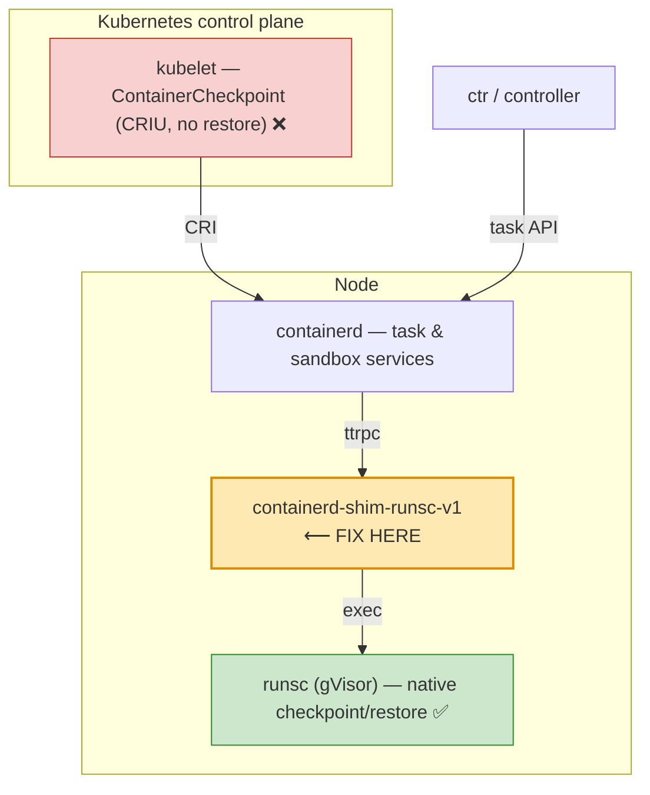
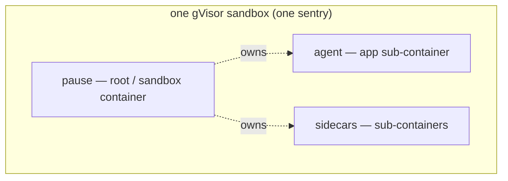
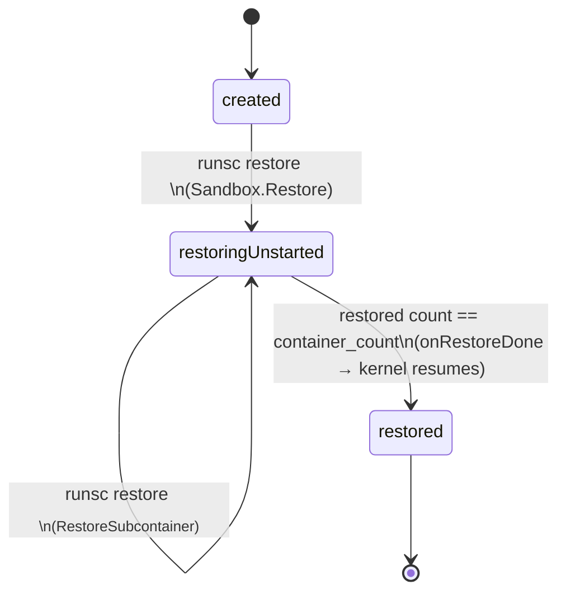

# High-Level Design — runsc-task-restore

## 1. Goal

**Snapshot, restore, and fork** gVisor-isolated Kubernetes pods (agent
sandboxes) while preserving in-memory process state — the E2B/Cloudflare-style
capability. gVisor's `runsc` runtime implements native, sandbox-wide checkpoint/
restore, but no orchestration layer exposed it. This work wires it into the
containerd shim so a normal pod create/start can fork a running pod.

## 2. Where the fix belongs



Why the shim (not kubelet or containerd-core):

- It is gVisor's own adapter between containerd and `runsc`.
- It already knows the pod ↔ container topology (CRI annotations:
  `container-type`, `sandbox-id`, `container-name`).
- The `runsc` checkpoint/restore primitive underneath already works.
- kubelet (`ContainerCheckpoint` is CRIU-only, no restore verb) and
  containerd-core need **no changes**.

## 3. Pod = a multi-container gVisor sandbox



Consequences that shape the design:

- **Checkpoint is sandbox-wide.** `runsc checkpoint <any-id>` serializes the
  entire sentry (all containers) and records the **container count** + each
  container's spec in the image metadata
  (`runsc/boot/restore.go`: `ContainerCountKey`, `ContainerSpecsKey`).
- **Restore is a whole-sandbox unit.** gVisor refuses to restore a sub-container
  into a cold-started sandbox (`cannot restore subcontainer: sandbox is not
  being restored`). The sandbox root must be restored first.

## 4. The restore state machine (runsc internals)



- Restoring the **root** sets `state = restoringUnstarted` and reads
  `totalContainers` from the checkpoint metadata
  (`runsc/boot/controller.go`).
- Each **sub-container** restore must observe `restoringUnstarted` or it errors
  out; it adds the container, and when `len(restored) == totalContainers` the
  loader resumes the whole kernel.

## 5. Container ID remap by name (why fork works)

The source pod and the forked pod have **different** container IDs. On restore,
gVisor walks every restored task and remaps its checkpoint container ID to the
new pod's ID **by container name** (`runsc/boot/restore.go`):

```go
name  := l.k.ContainerName(oldCid)        // from io.kubernetes.cri.container-name
newCid := l.containerIDs[name]            // name -> new CID (registered per restore call)
task.RestoreContainerID(newCid)
l.k.RestoreContainerMapping(l.containerIDs)
```

Kubernetes reuses the same container names across pods (`pause`, `counter`, …),
so the names line up and no rewriting is needed. For the rename case gVisor also
honors `dev.gvisor.container-name-remap.<id>: "<from>=<to>"`
(`runsc/specutils/specutils.go`).

## 6. What the shim change does

The shim (`pkg/shim/v1`) registers the standard containerd Task service; CRI
creates the pause/root and every sub-container through the task `Create`/`Start`
methods (the runsc shim does not implement the sandbox API, so the legacy
task-based pod-sandbox path is used). The changes:

| Component | Change |
|---|---|
| `runsccmd.Runsc.Checkpoint` + `CheckpointOpts` | new — `runsc checkpoint --image-path … --leave-running` |
| `proc.Init.Checkpoint` | new — calls the runtime without holding `p.mu` across the exec |
| `runsc.Container.Checkpoint` | new — guards `task == nil`, image path from `CheckpointTaskRequest.Path` |
| `runscService.Checkpoint` | implemented (was `ErrNotImplemented`) |
| `runscService.Start` | restores from the whole-sandbox image when `dev.neevcloud.restore-image-path` is on the container spec — for the root **and** sub-containers |

`Start` reads the container's OCI spec; if the restore annotation is present it
calls the pre-existing `Container.Restore` (→ `Init.start` with a
`RestoreConfig` → `runsc restore --detach`) instead of cold start. The pause
container is started first by CRI, so the root is restored before the
sub-containers — matching the state machine in §4. The annotation is pod-wide
(containerd `pod_annotations` passthrough), so every container restores from the
same image.

## 7. End-to-end fork flow

```mermaid
sequenceDiagram
    autonumber
    participant Ctl as operator / controller
    participant CD as containerd (CRI)
    participant Shim as runsc shim (patched)
    participant RS as runsc / sentry

    Note over Ctl,RS: snapshot the source pod
    Ctl->>CD: ctr tasks checkpoint <any container in pod A>
    CD->>Shim: Checkpoint(Path=/img)
    Shim->>RS: runsc checkpoint --leave-running --image-path=/img
    RS-->>Ctl: whole-sandbox image (metadata: container_count, specs); pod A keeps running

    Note over Ctl,RS: fork → new pod B (annotation: restore-image-path=/img)
    CD->>Shim: Start(pause@B)
    Shim->>RS: runsc restore <pause@B>  → state=restoringUnstarted, totalContainers=N
    CD->>Shim: Start(app@B)
    Shim->>RS: runsc restore <app@B>    → RestoreSubcontainer; count==N → resume
    RS-->>Ctl: pod B running with pod A's memory (same UUID), then diverges
```

## 8. Operational requirements

- containerd runtime config must pass the annotation through to the OCI spec:
  `pod_annotations = ["dev.neevcloud.*"]` on the `runsc` runtime.
- `systrap` platform (works without nested virtualization).
- The checkpoint image must be reachable on the node where the forked pod is
  scheduled (local path in this POC; an object-store fetch in production).

## 9. Productionization notes (beyond this POC)

- A **fork controller** (or the agent-sandbox controller): on `snapshot`,
  `ctr tasks checkpoint` the source pod and store the image; on `fork`, stamp
  the new pod's CR/annotations with the image path so containerd drives the
  coordinated restore.
- Honor `CheckpointTaskRequest.Options` (`--exit`) instead of always
  `--leave-running`.
- Re-establish cgroup/OOM notifications on restore (upstream TODO).
- Cross-node fork: ship the image; snapshot storage, retention, and GC.
