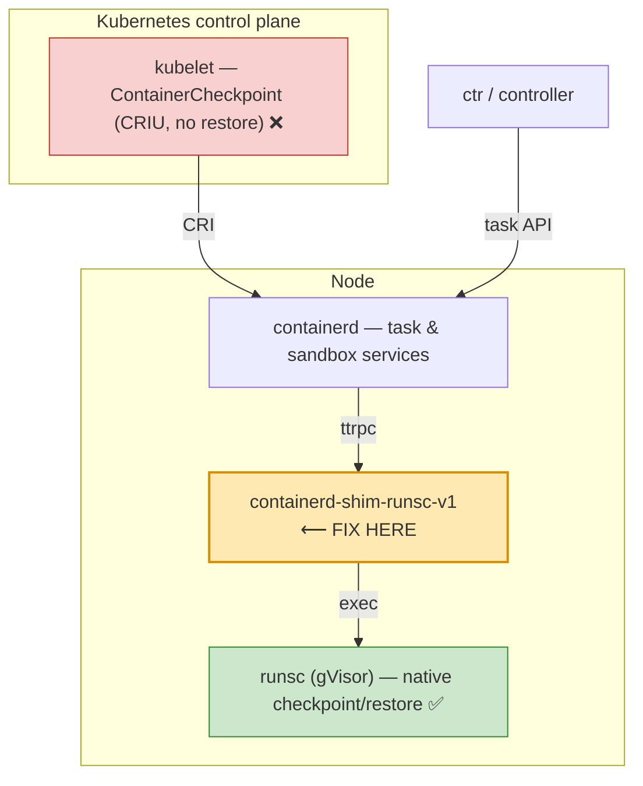
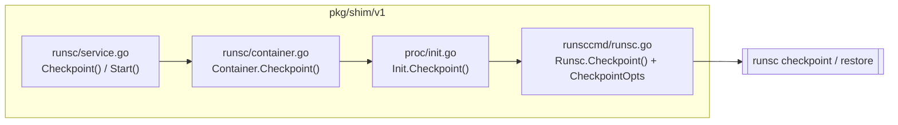
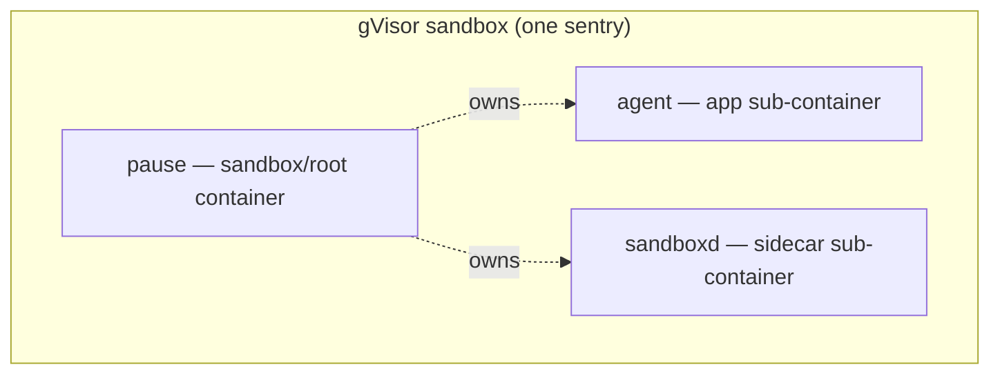
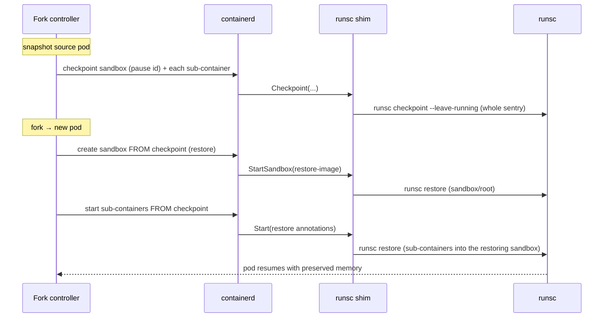

# High-Level Design — runsc-task-restore

## 1. Problem

We want **snapshot, restore, and fork** of gVisor-isolated Kubernetes pods
(agent sandboxes), preserving in-memory process state — the E2B/Cloudflare-style
capability. gVisor's `runsc` runtime already implements native checkpoint/
restore of a sandbox, but no orchestration layer exposes it:

- **kubelet** (`ContainerCheckpoint` CRI API) is hardwired to **CRIU** and has
  **no restore verb**. CRIU cannot checkpoint a gVisor sandbox.
- **containerd task API** (`ctr tasks checkpoint`) forwards to the runtime shim;
  the runsc shim returns **`ErrNotImplemented`**.
- **raw `runsc` CLI** works, but only for **single-container** sandboxes and
  with no integration into pod lifecycle.

## 2. Where the fix belongs



The **shim** is the correct insertion point:

- It is gVisor's own adapter between containerd and `runsc`.
- It already knows the pod ↔ container topology (CRI annotations:
  `container-type`, `sandbox-id`, `container-name`).
- The `runsc` checkpoint/restore primitive underneath already works — only the
  shim wiring is missing.
- kubelet and containerd-core need **no changes**.

## 3. What already existed vs. what we added

The gVisor shim (`pkg/shim/v1`) already had a **`Restore`** path
(`extension.RestoreRequest{ImagePath}` → `Container.Restore` → `Init.start`
with a `RestoreConfig` → `runsc restore`). It was unreachable over stock
containerd (the task API has no `Restore` RPC; it's wired for gVisor's own
containerd integration). **Only `Checkpoint` was missing.**

| Component | Before | After (this POC) |
|---|---|---|
| `runsccmd.Runsc.Checkpoint` | absent | added — `runsc checkpoint --image-path … --leave-running` |
| `proc.Init.Checkpoint` | absent | added — locks + calls runtime |
| `runsc.Container.Checkpoint` | absent | added — uses `CheckpointTaskRequest.Path` |
| `runscService.Checkpoint` | `ErrNotImplemented` | implemented — looks up container, checkpoints |
| `runscService.Start` | cold start only | restore when restore annotations select the container |

## 4. Components and data flow



- **Checkpoint path:** `Checkpoint(CheckpointTaskRequest{ID, Path})` →
  `getContainer(ID)` → `Container.Checkpoint` → `Init.Checkpoint` →
  `Runsc.Checkpoint(id, {ImagePath: Path, LeaveRunning: true})`.
- **Restore path (annotation):** `Start` reads the container OCI spec; if
  `dev.neevcloud.restore-image-path` is set and this container is the named
  app container (`dev.neevcloud.restore-container`, never the sandbox/root), it
  calls the pre-existing `Container.Restore` with that image path.

## 5. Annotation contract

Pod-wide annotations reach every container's OCI spec via containerd runtime
passthrough (`pod_annotations = ["dev.neevcloud.*"]`). To avoid restoring the
`pause` and sidecar containers from the app's checkpoint, the shim restores a
container only when:

1. `dev.neevcloud.restore-image-path` is non-empty, **and**
2. the container is **not** the sandbox/root (`utils.IsSandbox` is false), **and**
3. its `io.kubernetes.cri.container-name` matches
   `dev.neevcloud.restore-container`.

## 6. The pod-fork invariant (why app-only restore is not enough)

A Kubernetes pod on gVisor is one sentry hosting multiple containers:



Restoring only the `agent` sub-container into a **freshly-started** sandbox is
rejected by gVisor:

```
cannot restore subcontainer: sandbox is not being restored, state=started
```

gVisor requires the **sandbox itself to be under restore** before any
sub-container can be restored into it. Checkpoint/restore is a **whole-sandbox**
operation.

## 7. Next layer — whole-sandbox restore (for true pod fork)

To fork a pod end to end, the design extends to the containerd **Sandbox**
service (`CreateSandbox`/`StartSandbox`), which the shim also serves:



Required work beyond this POC:

- A **restore variant of `StartSandbox`** so the pod's `pause`/sandbox is created
  via `runsc restore` (not started cold).
- **Identity regeneration** on restore: rewrite `linux.cgroupsPath` to the new
  pod's kubelet slice and point `io.kubernetes.cri.sandbox-id` at the new
  sandbox (the two things that broke hand-rolled raw-`runsc` restores).
- A **fork controller** (or the agent-sandbox controller) to: checkpoint the
  whole source sandbox, store the images, and stamp the new pod's CR/annotations
  so containerd drives the coordinated sandbox+sub-container restore.

## 8. Scope and non-goals

- In scope: shim `Checkpoint` implementation; annotation-driven restore trigger;
  empirical mapping of what works and what gVisor forbids.
- Out of scope (documented, not built): whole-sandbox restore via the Sandbox
  service; the fork controller; cross-node restore; storage/GC of images.
