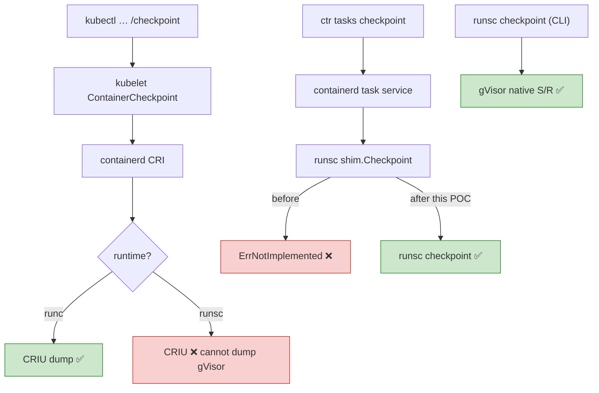
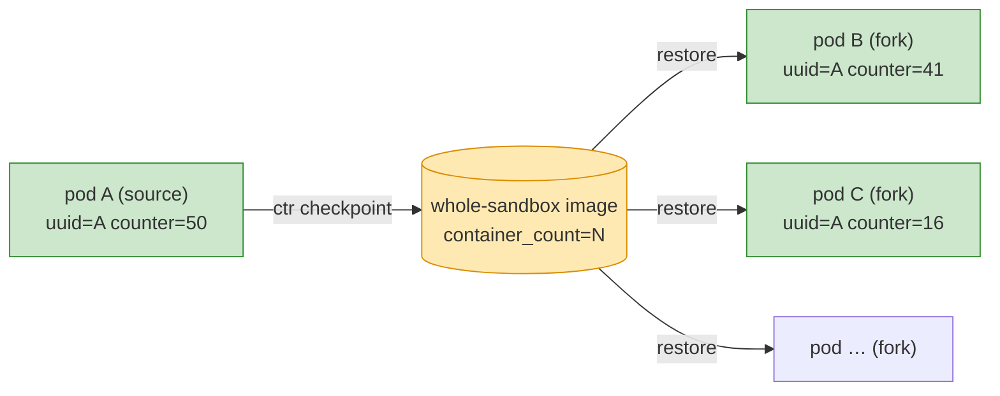
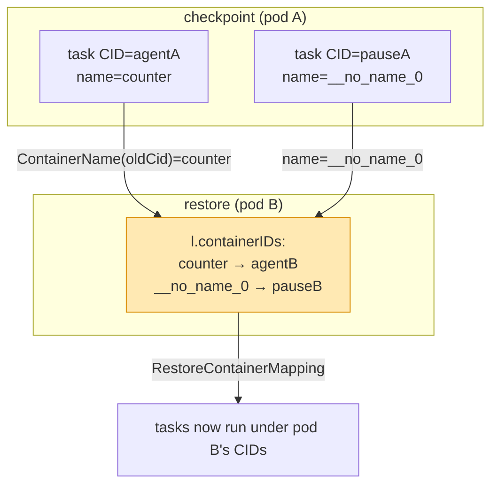
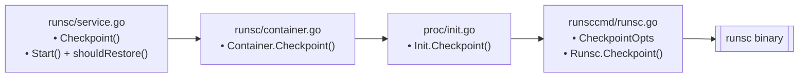

# Flow Diagrams — runsc-task-restore

All diagrams render on GitHub (Mermaid).

## 1. The three checkpoint paths (only the shim path reaches gVisor)



## 2. Checkpoint flow (sandbox-wide)

```mermaid
sequenceDiagram
    autonumber
    participant Client as ctr / controller
    participant CD as containerd
    participant Shim as runsc shim (patched)
    participant RS as runsc
    participant GV as gVisor sentry (whole pod)

    Client->>CD: tasks checkpoint --image-path P <any container in pod>
    CD->>Shim: Checkpoint(CheckpointTaskRequest{ID, Path=P})
    Shim->>Shim: getContainer(ID) → Container.Checkpoint (task != nil)
    Shim->>RS: runsc checkpoint --image-path=P --leave-running ID
    RS->>GV: serialize entire sentry (all containers)
    GV-->>RS: checkpoint.img / pages.img + metadata{container_count, specs}
    RS-->>Shim: exit 0 (containers left running)
    Shim-->>Client: ok ; source pod stays Running
```

## 3. Whole-sandbox restore — the state machine

```mermaid
stateDiagram-v2
    [*] --> created
    created --> restoringUnstarted: Start(pause) → runsc restore root\n(Sandbox.Restore; reads container_count)
    restoringUnstarted --> restoringUnstarted: Start(sub) → runsc restore\n(RestoreSubcontainer)
    restoringUnstarted --> restored: restored == container_count\n→ kernel resumes
    restored --> [*]
```



## 4. Working pod fork — end to end

```mermaid
sequenceDiagram
    autonumber
    participant Op as operator
    participant CD as containerd (CRI)
    participant Shim as runsc shim (patched)
    participant RS as runsc / sentry

    Note over Op,RS: source pod A (uuid=A, counter climbing)
    Op->>CD: ctr tasks checkpoint agent@A → /img
    CD->>Shim: Checkpoint
    Shim->>RS: runsc checkpoint --leave-running
    RS-->>Op: image (container_count=N) ; pod A keeps running ✅

    Note over Op,RS: fork → pod B  (annotation restore-image-path=/img on the pod)
    CD->>Shim: Start(pause@B)
    Shim->>RS: runsc restore pause@B  → restoringUnstarted, total=N
    CD->>Shim: Start(agent@B)
    Shim->>RS: runsc restore agent@B  → RestoreSubcontainer ; count==N → resume
    Note over RS: remap checkpoint CIDs → B's CIDs by container NAME
    RS-->>Op: pod B Running, uuid=A, counter continues, then diverges ✅
```

## 5. One-to-many fork



All forks share the source's captured memory (same `uuid`/`start`) and then run
independently (diverging counters).

## 6. Container ID remap by name



## 7. Component map (patch targets in gVisor pkg/shim/v1)


