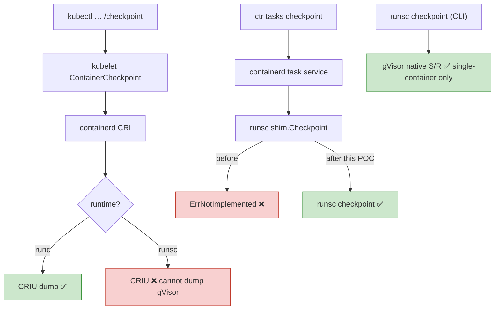
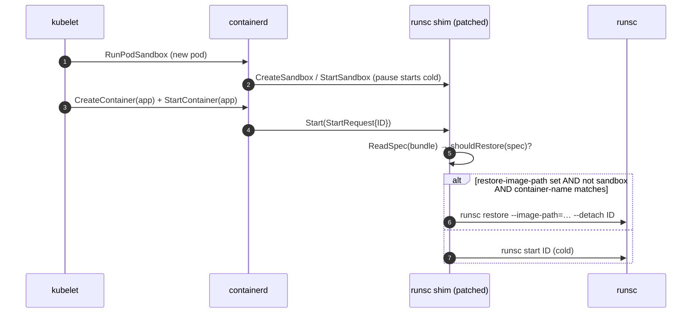
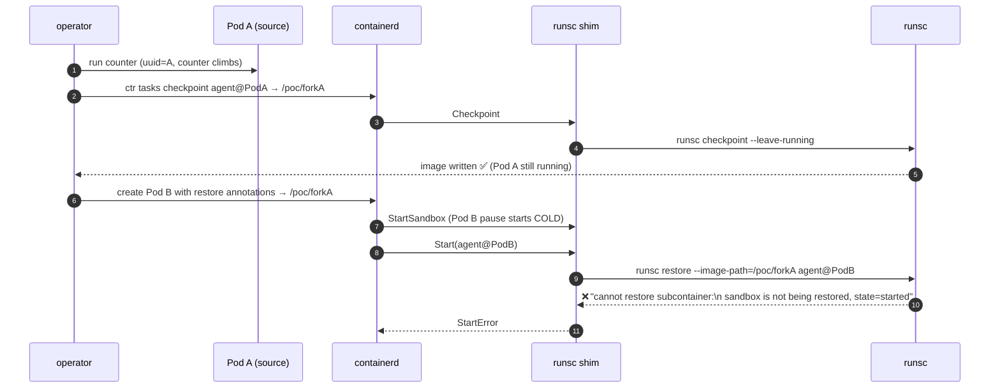
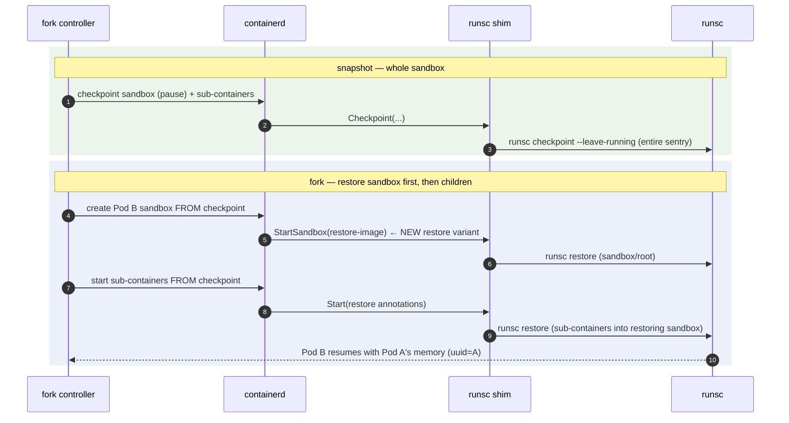
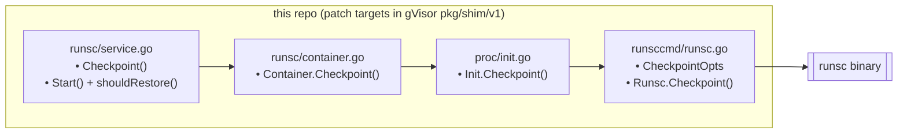

# Flow Diagrams — runsc-task-restore

All diagrams render on GitHub (Mermaid).

## 1. The three checkpoint paths (only the shim path reaches gVisor)



## 2. Checkpoint flow (implemented)

```mermaid
sequenceDiagram
    autonumber
    participant Client as ctr / controller
    participant CD as containerd
    participant Shim as runsc shim (patched)
    participant RS as runsc
    participant GV as gVisor sentry

    Client->>CD: tasks checkpoint --image-path P <ctr>
    CD->>Shim: Checkpoint(CheckpointTaskRequest{ID, Path=P})
    Shim->>Shim: getContainer(ID) → Container.Checkpoint
    Shim->>RS: runsc checkpoint --image-path=P --leave-running ID
    RS->>GV: serialize sentry state → checkpoint.img / pages.img
    GV-->>RS: done (container left running)
    RS-->>Shim: exit 0
    Shim-->>CD: Empty
    CD-->>Client: ok ; pod stays Running
```

## 3. Restore trigger flow (implemented)



## 4. Pod fork attempt — and where gVisor blocks it



The sandbox (Pod B's `pause`) was started cold, so gVisor refuses to restore the
sub-container into it.

## 5. The fix for fork — whole-sandbox restore (next layer)



## 6. Component map


