# Walkthrough — from kubelet to container start, then checkpoint/restore

A complete, layer-by-layer explanation of how a gVisor pod starts, how gVisor
manages it, and how checkpoint/restore (and fork) work — at the containerd shim
and inside `runsc`.

Contents:
1. [kubelet → container start](#1-kubelet--container-start)
2. [How gVisor manages the pod](#2-how-gvisor-manages-the-pod)
3. [How containerd does checkpoint/restore](#3-how-containerd-does-checkpointrestore)
4. [How runsc checkpoints](#4-how-runsc-checkpoints)
5. [How runsc restores (state machine)](#5-how-runsc-restores-state-machine)
6. [Container ID remap by name (why fork works)](#6-container-id-remap-by-name)
7. [Deep dives: page loading, gofer, netstack](#7-deep-dives)

---

## 1. kubelet → container start

A pod with `runtimeClassName: gvisor` is built incrementally: the `pause`
container starts first and *creates the sandbox*, then each app/sidecar
container is created as a sub-container that joins it.

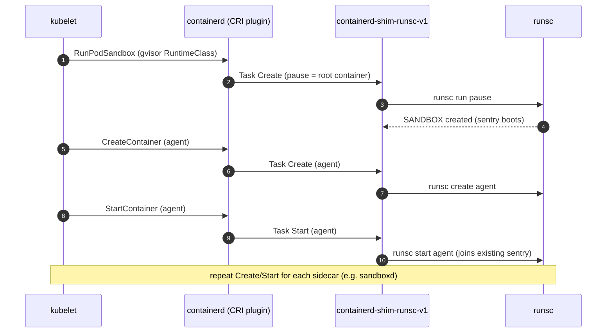

Live proof — one pod shows two runsc entries sharing one sentry PID:

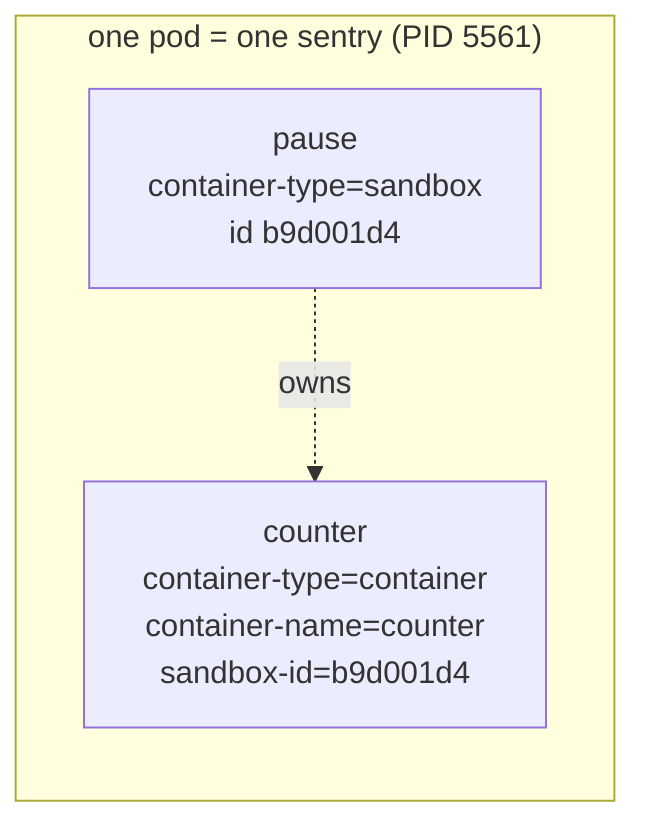

---

## 2. How gVisor manages the pod

`runsc` is an OCI runtime, but instead of running your process on the host
kernel it interposes a userspace kernel (the sentry). One pod = one sentry
hosting all containers.

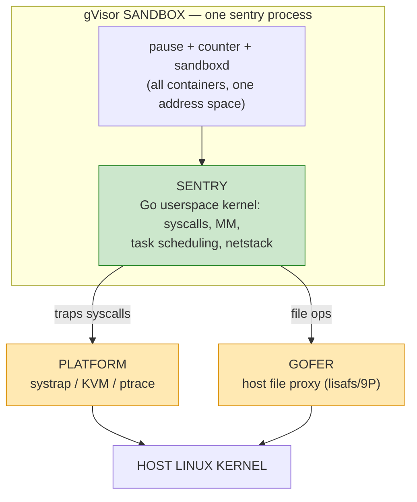

- **Sentry** — the application kernel. Container syscalls never hit the host
  kernel directly; this is the isolation boundary. All container state lives
  here, which is what makes a single, sandbox-wide checkpoint possible.
- **Platform** — how syscalls are trapped. We use `systrap` (no nested
  virtualization, important when the node is itself a container).
- **Gofer** — a separate host process proxying filesystem access.

---

## 3. How containerd does checkpoint/restore

containerd never checkpoints directly — it forwards to the runtime shim. Only
one of the three entry points reaches gVisor's native mechanism.

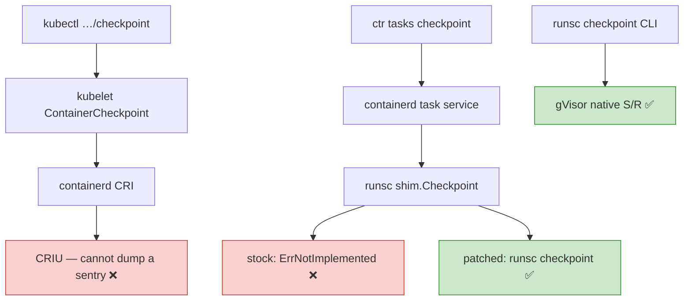

The patch wires `shim.Checkpoint` (was `ErrNotImplemented`) down to the `runsc`
CLI, mirroring the existing restore plumbing:

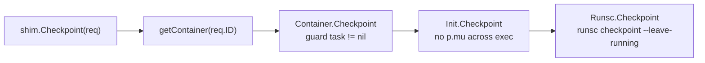

---

## 4. How runsc checkpoints

`runsc checkpoint <any-container-id>` serializes the entire sentry and writes
three files plus metadata. The metadata is what makes multi-container restore
possible.

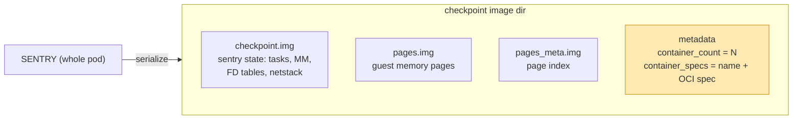

`runsc/boot/restore.go` writes the **whole-pod** count, so checkpointing any
container captures the entire sandbox:

```text
saveOpts.Metadata[ContainerCountKey] = strconv.Itoa(l.containerCount())
saveOpts.Metadata[ContainerSpecsKey] = specsStr
```

---

## 5. How runsc restores (state machine)

gVisor refuses to restore a sub-container into a cold-started sandbox
(`cannot restore subcontainer: sandbox is not being restored`). Restore is a
whole-sandbox unit:

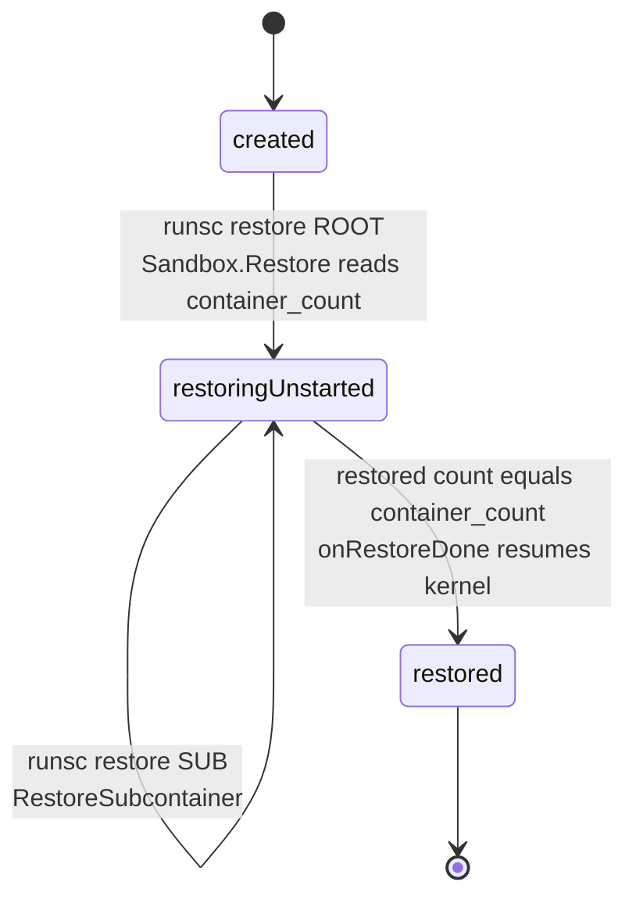

The shim drives this from a normal pod create — every container carries the
pod-wide restore annotation, and `Start` runs `runsc restore` instead of cold
start:

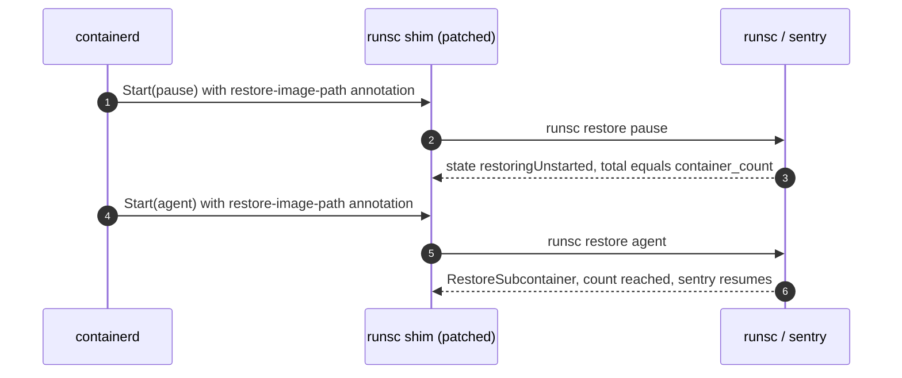

---

## 6. Container ID remap by name

The source pod and the forked pod have different container IDs. On restore
gVisor remaps each task's checkpoint container ID to the new pod's ID by
container **name** (`runsc/boot/restore.go`), so forks need no rewriting because
Kubernetes reuses container names.

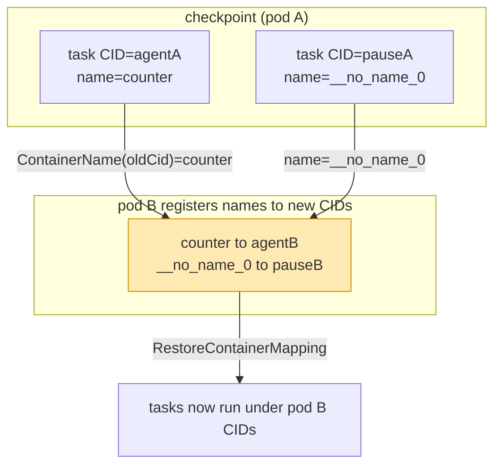

For the rename case gVisor honors `dev.gvisor.container-name-remap.<id>` with a
`from=to` value (`runsc/specutils/specutils.go`).

---

## 7. Deep dives

### 7a. Asynchronous page loading

The sentry state file (`checkpoint.img`) is deserialized by `LoadFrom`, while
guest memory pages (`pages.img` + `pages_meta.img`) stream in **asynchronously**
via an `AsyncMFLoader` (`runsc/boot/restore.go`). With `--background`, page
loading continues after the restore call returns, so the container can start
running before every page is resident.

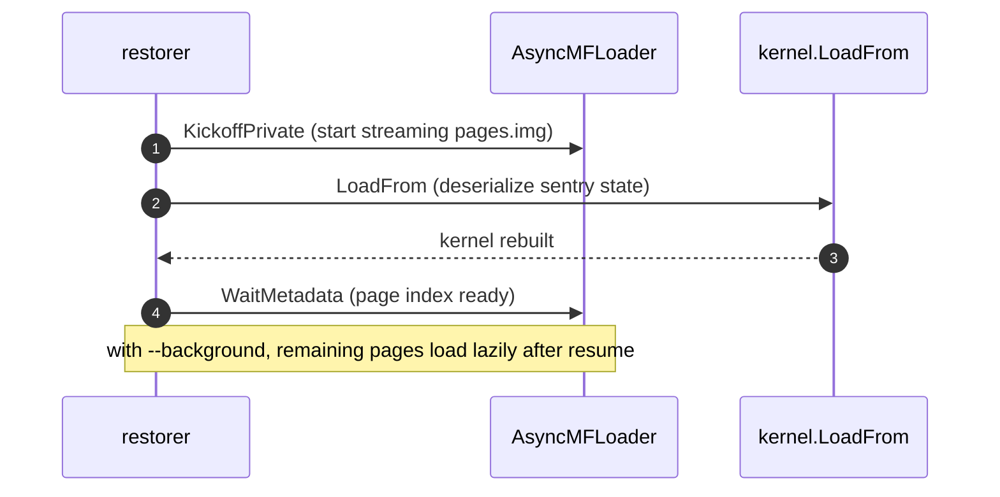

### 7b. Gofer re-establishment

The gofer is **not** restored from the image. On restore a fresh gofer process
is created (`createGoferProcess` in `runsc/container/container.go`) and its FDs
(`goferFiles`, `goferFilestores`) are handed to the restored sandbox, so the
rootfs and mounts are reconnected to the current host paths. This is why a
forked pod's filesystem mounts work even though the IDs changed.

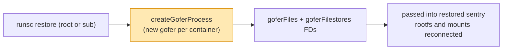

### 7c. Netstack and sockets

gVisor's in-sandbox network stack (netstack) is part of the serialized sentry
state, so its interfaces, routes, and listening sockets are restored
(`afterLoad` hooks rebuild TCP endpoint state in `pkg/tcpip`). Two caveats:

- Established TCP connections survive only if save-restore capability is set
  (`GetAllowConnectedOnSave`); otherwise they are dropped on save.
- Host-backed sockets (`hostinet`) reference host FDs and cannot be meaningfully
  carried across a checkpoint.

For the fork demo the workload holds no sockets, so this does not apply — but it
is the boundary to know for stateful network workloads.

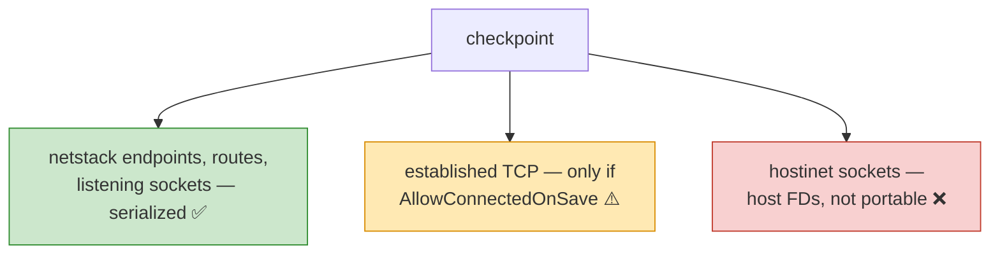

---

See [HLD.md](HLD.md) for the design rationale and [flows.md](flows.md) for the
end-to-end checkpoint/fork sequences. All diagrams in this repo are validated
with `@mermaid-js/mermaid-cli`.
